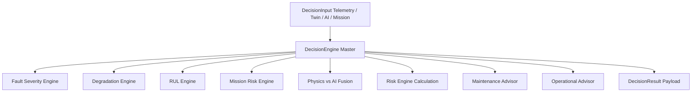

# Decision Support System (DSS) — SIH 2026 Module

## 1. Overview
The **Decision Support System (DSS)** is a modular, configurable engineering decision layer for the **MALE UAV Aero-Piston Engine Digital Twin**. It converts telemetry state, physics-model residuals, fault diagnoses, degradation rates, RUL predictions, AI anomaly scores, and mission environmental stressors into actionable operational advisories and maintenance decisions.

---

## 2. Architecture & Design Principles
- **Modular & Decoupled**: Independent Python components (`fault_severity`, `degradation_engine`, `rul_engine`, `mission_risk`, `fusion_engine`, `risk_engine`, `confidence_manager`, `maintenance_advisor`, `operational_advisor`).
- **Configuration-Driven**: All thresholds, weights, fault definitions, and mission stress parameters live in PyYAML configuration files (`config/`).
- **Interface Stability**: Consumes standardized Pydantic state payloads (`DecisionInput`) and emits standardized JSON responses (`DecisionResult`).



---

## 3. Output Schema Specification
```yaml
decision:
  risk_level: LOW | MODERATE | HIGH | CRITICAL
  risk_score: float (0.0 to 1.0)
  confidence: float (0.0 to 1.0)

fault_assessment:
  status: NORMAL | WARNING | CRITICAL
  severity: float (0.0 to 1.0)
  primary_fault: string or null

degradation_assessment:
  status: NORMAL | DEGRADING | CRITICAL
  overall_degradation: float (0.0 to 1.0)
  trend: STABLE | INCREASING | RAPIDLY_INCREASING | DECREASING

rul_assessment:
  rul_hours: float
  status: NORMAL | PLANNING | HIGH_PRIORITY | CRITICAL
  confidence: float (0.0 to 1.0)

mission_assessment:
  mission_risk: LOW | MODERATE | HIGH | CRITICAL
  mission_go: boolean

maintenance:
  priority: ROUTINE | PLANNED | HIGH | IMMEDIATE
  recommendation: string

operational:
  recommendation: string

explanation:
  - list of human-readable evidence & reasoning strings
```

---

## 4. Quickstart & Testing

### Running Tests
```bash
pytest decision_support/tests/ -v
```

### Running REST API Server
```bash
python3 -m uvicorn decision_support.api.main:app --host 0.0.0.0 --port 8001
```

### Example Endpoints
- `GET /health`: Server status
- `GET /version`: Model & schema version identifiers
- `POST /decision/evaluate`: Evaluate `DecisionInput` and return `DecisionResult`
